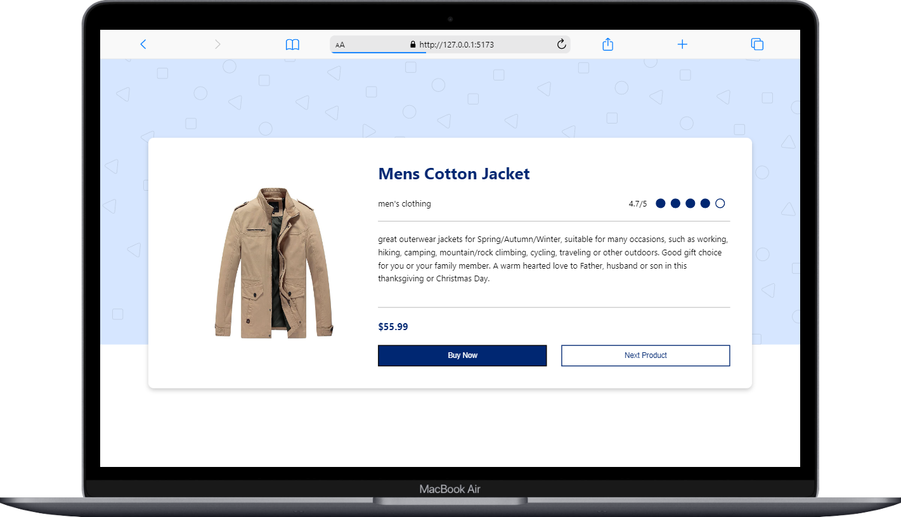
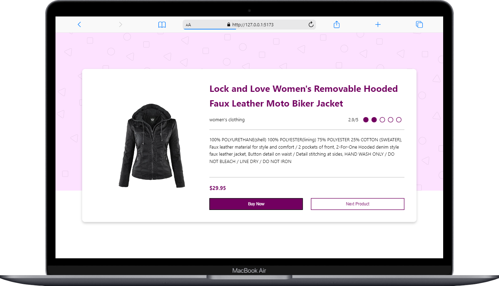
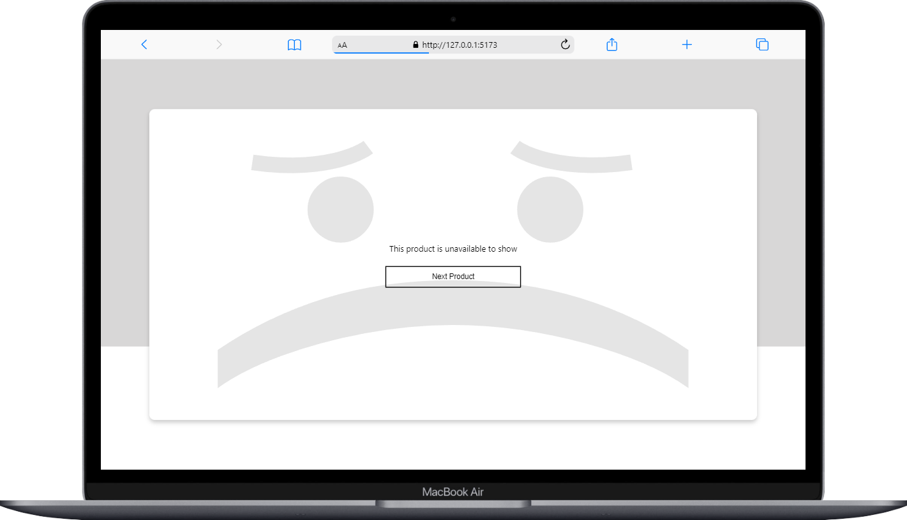

## ecommerce-catalog 
Dibangun untuk memenuhi tugas akhir dalam menyelesaikan virtual Internship Frontend Developer.

## Case Study and Soal
1. Menampilkan data yang didapat dari API https://fakestoreapi.com dengan index merupakan angka
1-20 yang di tiap index-nya memiliki kategori yang berbeda, misalnya
https://fakestoreapi.com/products/1 yang memiliki kategori men’s clothing

2. Produk yang ditampilkan hanya 1, namun akan berubah setiap kali user menekan tombol Next
Product

3. Sediakan loading element/loader yang akan ditampilkan ketika menunggu balasan dari API sehingga
desain tetap UX friendly. Loader bisa berupa spinner
(https://www.w3schools.com/howto/howto_css_loader.asp) atau skeleton

(https://dev.to/devggaurav/build-a-simple-card-skeleton-loader-component-using-html-and-
css-3a20)

4. Membentuk tiga halaman website sesuai dengan desain yang telah di sediakan di Figma

## Interface UI

### Man's Category
 

### Woman's Category
 

### Category Not Available
 